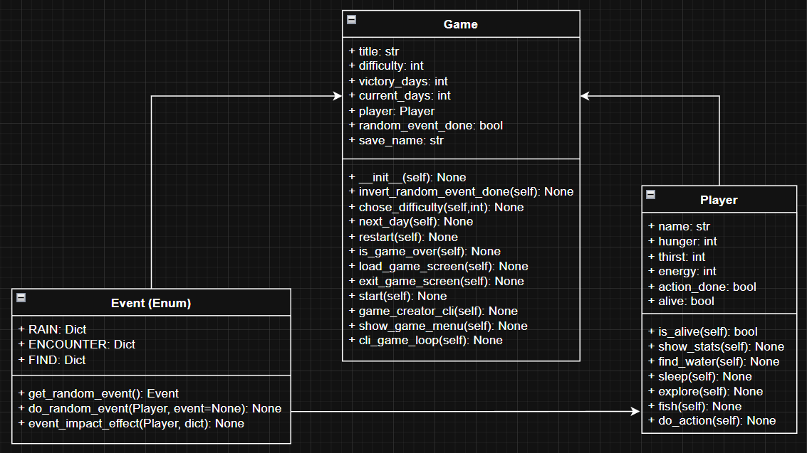

# Crusoe

---

[](LICENSE)
[](https://www.python.org/)


---
## 📝 Description
**Crusoe** is a python survivalist game where you must fend off wildlife to survive in a harsh wilderness environment for a set number of days.

---

## 🌟 Features

- **💾 Save and load your game progress**
- **🎲 Random events during gameplay**
- **🐟 Fishing minigame**
- **🧭 Exploration minigame**

---

## 📁 Project structure

```

├── 📁 classes
│   ├── 🐍 events.py
│   ├── 🐍 game.py
│   └── 🐍 player.py
├── 📁 data
│   ├── 📁 save
│   │   └── ⚙️ save.json
│   ├── ⚙️ fishes.json
│   └── ⚙️ sleep_story.json
├── 📁 services
│   ├── 🐍 jsonServices.py
│   └── 🐍 saveServices.py
├── 📁 utils
│   ├── 🐍 displayUtils.py
│   └── 🐍 miniGameUtils.py
├── ⚙️ .gitignore
├── 📄 LICENSE
├── 📝 README.md
├── 🖼️ image.png
└── 🐍 main.py
```



---

## 🛠️ Technical Stack

- **ASCII art**
    - **[art](https://pypi.org/project/art)**
    - **[fishs](https://www.asciiart.eu/animals/fish)**

- **Backend** :
    - **[Python](https://www.python.org)**

- **Outils de développement** :
    - **Git**

---

## ⚙️ Installation and Execution

1. Clone the Git repository:
```bash
git clone https://github.com/Zeteox/Survivalist-Python.git
```

2. Open a console in the project directory and install dependencies:
```bash
py -m pip install art
```

2. Launch the game using the command line or open **start.bat**:
```bash
py ./main
```

---

## 📬 Contact

For any questions or issues, feel free to reach out:

### Loïc DELPRAT
- **Email** : [loic.delprat@ynov.com](mailto:loic.delprat@ynov.com)
- **LinkedIn** : [Loïc DELPRAT](https://linkedin.com/in/loïc-delprat)
- **GitHub** : [Zeteox](https://github.com/Zeteox)

### Ylan DESSENE
- **Email** : [ylan.dessenne@ynov.com](mailto:ylan.dessenne@ynov.com)
- **LinkedIn** : [ylan DESSENNE](https://linkedin.com/in/dessenne-ylan)
- **GitHub** : [Torolgo](https://github.com/Torolgo)

---